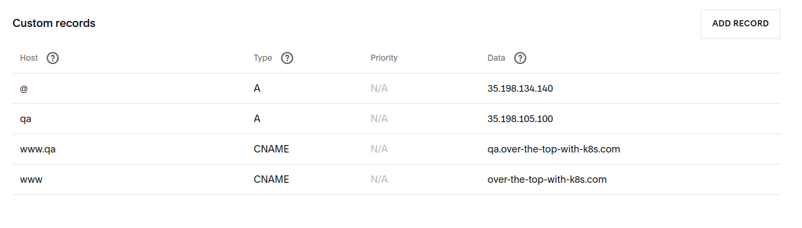

# k8s environment setup

## Local development environment setup on minikube

### Start minikube

To start minikube run the following command:

```sh
minikube start
```

### Setting up ingress on minikube

This step is required only for minikube local development environment

```sh
minikube addons enable ingress
```

### Installing (deploying) the app to minikube with helm

To deploy the app on minikube with the latest version run:

```sh
helm install over-the-top-with-k8s helm_charts/over-the-top-with-k8s-dev/ --wait \
  --set overTheTopDatabase.auth.username=<psql_username> \
  --set overTheTopDatabase.auth.password=<psql_password>
```

or to deploy a specific version use

```sh
helm install over-the-top-with-k8s helm_charts/over-the-top-with-k8s-dev/ --wait \
  --set tag=<version> \
  --set overTheTopDatabase.auth.username=<psql_username> \
  --set overTheTopDatabase.auth.password=<psql_password>
```

where `<version>` is the git SHA of that specific version,  `<psql_username>` is the postgres username you want to use and `<psql_password>` is the postgres password you want to use.

In the development environment HTTPS is not set up and used so no cert-manager is used and also ingress-ngix configuration is different than in production.
That is why a special helm chart is used for development environment. 

##  Production/QA k8s environment setup

### Deploying the app to PROD/QA

To deploy the app to production or qa environment make a pull request to master or develop branches respectively and merge it.
The CD pipeline will then deploy the app automatically.

### Setting up a domain

Domain purchase and setup is necessary for the HTTPS/TLS to work properly.

After a deploy to PROD/QA connect to k8s cluster where the app was deployed and look up the ingress-nginx IP address (use kubectl or dashboard if it exists). Use the ingress-nginx IP address to set up the domain.

Here is an example of how to do it in Sqarespace (it should be similar for any other provider):


